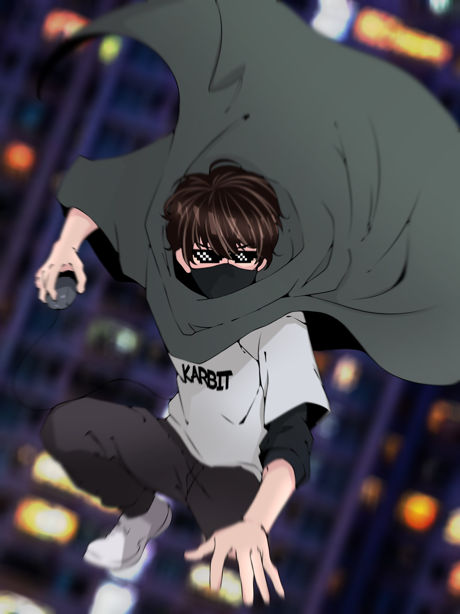

# Unyul Web



## Deskripsi

Unyul Web adalah situs web portfolio pribadi untuk Unyul, seorang DJ, Gamer, dan Streamer yang berbagi passion dalam musik, gaming, dan konten YouTube. Situs ini dibangun menggunakan Next.js dan menampilkan galeri karya, informasi tentang Unyul, serta fitur notifikasi YouTube.

## Fitur

- **Hero Section**: Tampilan utama dengan desain responsif dan gambar latar yang menarik.
- **Tentang Unyul**: Bagian yang menjelaskan latar belakang Unyul, termasuk video YouTube dan ikon interaktif untuk Musik & DJ, Gaming, dan Streamer.
- **Galeri**: Koleksi gambar dan karya Unyul.
- **Temukan**: Bagian untuk mencari atau menghubungi Unyul.
- **Footer**: Informasi kontak dan tautan sosial.
- **API YouTube Notify**: Endpoint untuk notifikasi terkait YouTube menggunakan Google APIs.

## Teknologi yang Digunakan

- **Next.js 15.5.2**: Framework React untuk aplikasi web.
- **React 19.1.0**: Library untuk membangun UI.
- **TypeScript**: Untuk type safety.
- **Tailwind CSS**: Framework CSS untuk styling.
- **Google APIs**: Untuk integrasi YouTube.
- **Lenis**: Untuk smooth scrolling.
- **Lucide React**: Untuk ikon.
- **Node Cron**: Untuk penjadwalan tugas.

## Instalasi

1. Pastikan Anda memiliki Node.js dan npm terinstal.
2. Clone repositori ini:
   ```
   git clone https://github.com/username/unyul-web.git
   ```
3. Masuk ke direktori proyek:
   ```
   cd unyul-web
   ```
4. Instal dependensi:
   ```
   npm install
   ```
5. Konfigurasi environment variables jika diperlukan (misalnya untuk Google APIs).

## Penggunaan

1. Jalankan server development:
   ```
   npm run dev
   ```
2. Buka browser dan akses `http://localhost:3000`.

3. Untuk build production:
   ```
   npm run build
   npm start
   ```

## Struktur Proyek

```
unyul-web/
├── app/
│   ├── api/
│   │   └── youtube-notify/
│   │       └── route.ts
│   ├── components/
│   │   ├── about.tsx
│   │   ├── find.tsx
│   │   ├── footer.tsx
│   │   ├── gallery.tsx
│   │   ├── hero.tsx
│   │   └── navbar.tsx
│   ├── globals.css
│   ├── layout.tsx
│   └── page.tsx
├── public/
│   └── assets/
│       └── img/
│           ├── dj.jpg
│           ├── gaming.jpg
│           ├── image.png
│           └── unyuls.png
├── package.json
├── next.config.ts
├── postcss.config.mjs
├── tailwind.config.ts
├── tsconfig.json
└── README.md
```

## Kontribusi

Kontribusi sangat diterima! Silakan buat issue atau pull request untuk perbaikan atau fitur baru.

## Lisensi

Proyek ini dilisensikan di bawah MIT License.
